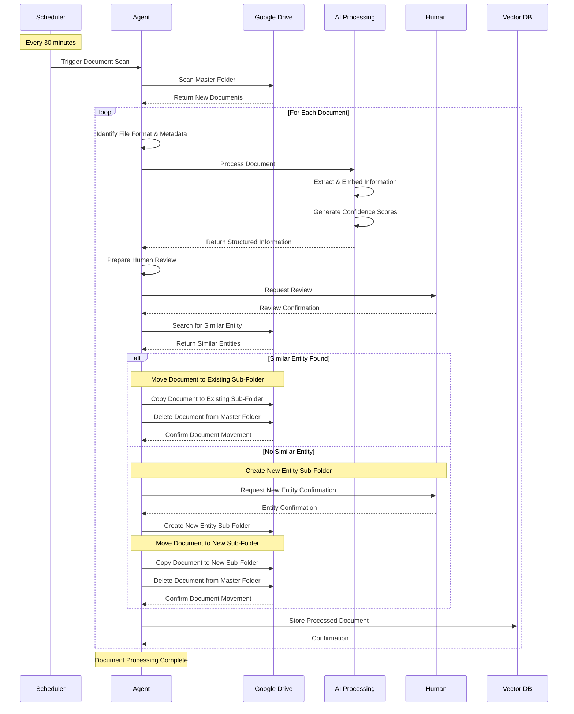

```mermaid
sequenceDiagram
    participant Scheduler
    participant Agent
    participant Drive as Google Drive
    participant AI as AI Processing
    participant Human
    participant DB as Vector DB

    Note over Scheduler: Every 30 minutes

    Scheduler->>Agent: Trigger Document Scan
    Agent->>Drive: Scan Master Folder
    Drive-->>Agent: Return New Documents

    loop For Each Document
        Agent->>Agent: Identify File Format & Metadata
        
        Agent->>AI: Process Document
        AI->>AI: Extract & Embed Information
        AI->>AI: Generate Confidence Scores
        AI-->>Agent: Return Structured Information

        Agent->>Agent: Prepare Human Review
        Agent->>Human: Request Review
        Human-->>Agent: Review Confirmation

        Agent->>Drive: Search for Similar Entity
        Drive-->>Agent: Return Similar Entities

        alt Similar Entity Found
            Note over Agent,Drive: Move Document to Existing Sub-Folder
            Agent->>Drive: Copy Document to Existing Sub-Folder
            Agent->>Drive: Delete Document from Master Folder
            Drive-->>Agent: Confirm Document Movement
        else No Similar Entity
            Note over Agent,Human: Create New Entity Sub-Folder
            Agent->>Human: Request New Entity Confirmation
            Human-->>Agent: Entity Confirmation
            Agent->>Drive: Create New Entity Sub-Folder
            Note over Agent,Drive: Move Document to New Sub-Folder
            Agent->>Drive: Copy Document to New Sub-Folder
            Agent->>Drive: Delete Document from Master Folder
            Drive-->>Agent: Confirm Document Movement
        end

        Agent->>DB: Store Processed Document
        DB-->>Agent: Confirmation
    end

    Note over Agent: Document Processing Complete
``` 