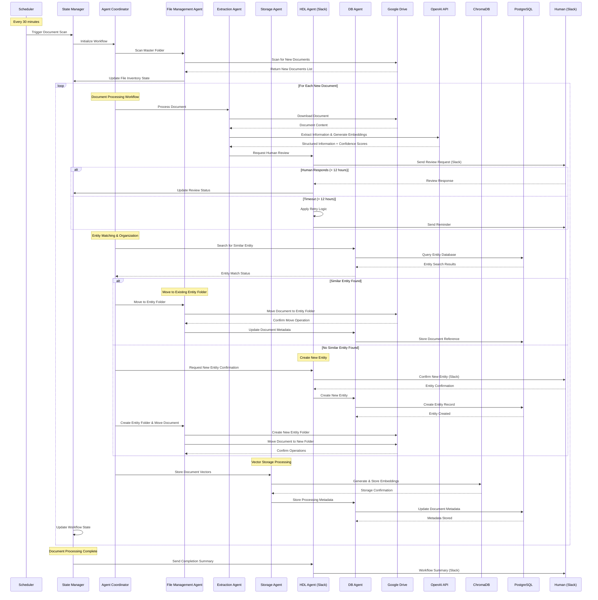

```mermaid
sequenceDiagram
    participant Scheduler
    participant StateManager as State Manager
    participant Coordinator as Agent Coordinator
    participant FileAgent as File Management Agent
    participant ExtractAgent as Extraction Agent
    participant StorageAgent as Storage Agent
    participant HDLAgent as HDL Agent (Slack)
    participant DBAgent as DB Agent
    participant Drive as Google Drive
    participant AI as OpenAI API
    participant VectorDB as ChromaDB
    participant PostgreSQL as PostgreSQL
    participant Human as Human (Slack)

    Note over Scheduler: Every 30 minutes

    Scheduler->>StateManager: Trigger Document Scan
    StateManager->>Coordinator: Initialize Workflow
    Coordinator->>FileAgent: Scan Master Folder
    
    FileAgent->>Drive: Scan for New Documents
    Drive-->>FileAgent: Return New Documents List
    FileAgent->>StateManager: Update File Inventory State
    
    loop For Each New Document
        Note over Coordinator: Document Processing Workflow
        
        Coordinator->>ExtractAgent: Process Document
        ExtractAgent->>Drive: Download Document
        Drive-->>ExtractAgent: Document Content
        
        ExtractAgent->>AI: Extract Information & Generate Embeddings
        AI-->>ExtractAgent: Structured Information + Confidence Scores
        
        ExtractAgent->>HDLAgent: Request Human Review
        HDLAgent->>Human: Send Review Request (Slack)
        
        alt Human Responds (< 12 hours)
            Human-->>HDLAgent: Review Response
            HDLAgent->>StateManager: Update Review Status
        else Timeout (> 12 hours)
            HDLAgent->>HDLAgent: Apply Retry Logic
            HDLAgent->>Human: Send Reminder
        end
        
        Note over Coordinator: Entity Matching & Organization
        
        Coordinator->>DBAgent: Search for Similar Entity
        DBAgent->>PostgreSQL: Query Entity Database
        PostgreSQL-->>DBAgent: Entity Search Results
        DBAgent-->>Coordinator: Entity Match Status
        
        alt Similar Entity Found
            Note over FileAgent: Move to Existing Entity Folder
            Coordinator->>FileAgent: Move to Entity Folder
            FileAgent->>Drive: Move Document to Entity Folder
            Drive-->>FileAgent: Confirm Move Operation
            FileAgent->>DBAgent: Update Document Metadata
            DBAgent->>PostgreSQL: Store Document Reference
        else No Similar Entity Found
            Note over HDLAgent: Create New Entity
            Coordinator->>HDLAgent: Request New Entity Confirmation
            HDLAgent->>Human: Confirm New Entity (Slack)
            Human-->>HDLAgent: Entity Confirmation
            
            HDLAgent->>DBAgent: Create New Entity
            DBAgent->>PostgreSQL: Create Entity Record
            PostgreSQL-->>DBAgent: Entity Created
            
            Coordinator->>FileAgent: Create Entity Folder & Move Document
            FileAgent->>Drive: Create New Entity Folder
            FileAgent->>Drive: Move Document to New Folder
            Drive-->>FileAgent: Confirm Operations
        end
        
        Note over StorageAgent: Vector Storage Processing
        
        Coordinator->>StorageAgent: Store Document Vectors
        StorageAgent->>VectorDB: Generate & Store Embeddings
        VectorDB-->>StorageAgent: Storage Confirmation
        
        StorageAgent->>DBAgent: Store Processing Metadata
        DBAgent->>PostgreSQL: Update Document Metadata
        PostgreSQL-->>DBAgent: Metadata Stored
        
        StateManager->>StateManager: Update Workflow State
    end
    
    Note over StateManager: Document Processing Complete
    StateManager->>HDLAgent: Send Completion Summary
    HDLAgent->>Human: Workflow Summary (Slack)
``` 