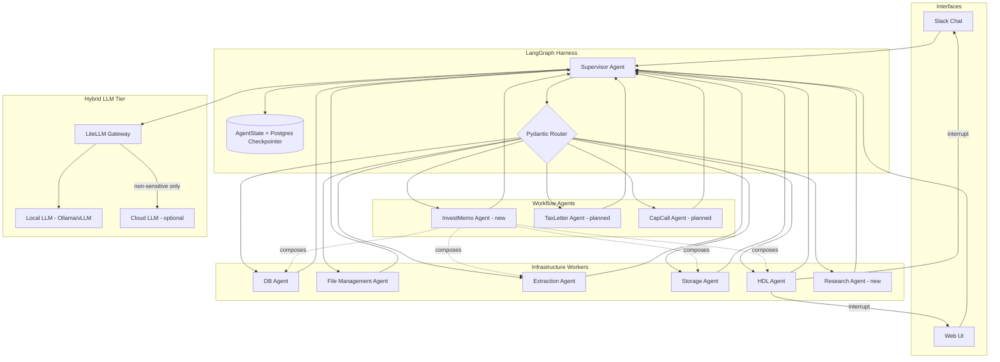

# Gabriel Agent — Multi-Agent Orchestration & Platform Plan (v2)

> **Status:** Draft — supersedes fragmented guidance in PRD §12, `docs/architecture.md`, and deployment-only plans.  
> **Date:** 2026-06-19  
> **Scope:** Orchestration harness, agent looping, UX/UI, local LLM privacy tier.

---

## 1. Executive Summary

The codebase has **two competing agent models** that were never fully reconciled:

| Layer | What exists today | Problem |
| --- | --- | --- |
| **Specialized agents** | 5 agents + `AgentCoordinator` (DB, File, Extraction, Storage, HDL) | Message routing works; no durable state, no loop control, no graph visibility |
| **User-facing agent** | Single `AgentExecutor` in `app/services/agent.py` with ~400-line system prompt | One LLM pretends to be all agents via `agent_query` tool; brittle, unauditable, sends all financial context to OpenAI |

The original PRD and architecture docs describe multi-agent coordination but the **runtime path for Slack/chat is still monolithic**. This plan unifies them under a **LangGraph Supervisor harness** with explicit state, circuit breakers, human-in-the-loop interrupts, and a **hybrid LLM tier** (local for sensitive data, cloud optional for complex reasoning).

**Immediate blocker (unchanged):** Agent Coordinator DB authentication — resolve before orchestration migration.

---

## 2. Current State Assessment

### 2.1 Implemented (keep)

- FastAPI backend with agent API endpoints (`/agents/status`, `/agents/message`)
- 5 specialized agents with `BaseAgent` contract
- Document pipeline: File Discovery → Extraction → Storage → HDL review
- Slack as HDL channel
- ChromaDB/FAISS vector search, Google Drive, OCR/PDF
- Cloud Run + Secret Manager + Cloud SQL (11/12 services healthy)

### 2.2 Architectural gaps

1. **No orchestration graph** — workflows are imperative `route_message()` calls; PRD Phase 3 LangGraph migration never started.
2. **No shared `AgentState`** — PRD §12.3 proposed `AgentState` + `StateManager`; not implemented.
3. **Implicit agent chaining** — Extraction Agent triggers Storage/HDL directly; coordinator doesn't own the full DAG.
4. **Monolithic chat agent** — `AgentExecutor` + OpenAI bypasses coordinator for most user queries.
5. **No loop safeguards** — no `recursion_limit`, revision counters, or routing validation.
6. **No checkpoint/resume** — HDL timeouts lose in-memory state on restart (partial mitigation via HDL DB table).
7. **No web UI** — ADR-001/005/007 approved Streamlit; zero implementation.
8. **100% cloud LLM** — all document text and queries go to OpenAI; unacceptable for family-office financial data long-term.

---

## 3. Target Architecture

### 3.1 Orchestration model: Supervisor + Specialist Workers

Use **LangGraph Supervisor pattern** (not peer-to-peer swarm) because Gabriel Agent requires audit trails, HDL gates, and deterministic routing for compliance workflows.



### 3.2 Agent roster (expanded)

**Infrastructure agents** — horizontal capabilities; each owns a primitive (CRUD, file ops, extraction, vector ops, approval).

| Agent | Role | LLM tier | Tools |
| --- | --- | --- | --- |
| **Supervisor** | Intent classification, routing, synthesis, termination | Local (routing) + Cloud optional (complex synthesis) | Router only — no direct data access |
| **DB Agent** | Entity registry, tasks, obligations, metadata CRUD | Local | PostgreSQL |
| **File Management Agent** | Drive scan, folder ops, ingestion queue | None (deterministic) | Google Drive |
| **Extraction Agent** | OCR, PDF parse, field extraction, confidence scoring | Local (document content never leaves perimeter) | OCR, PDF, Vision API (on-prem option later) |
| **Storage Agent** | Embeddings, vector search, chunk management | Local embeddings (e.g. nomic-embed) | ChromaDB |
| **HDL Agent** | Human approval workflow, Slack/Web notifications | None | Slack, Web push |
| **Research Agent** *(new)* | Cross-source synthesis (DB + vector + Drive) | Local | vector_search, read_sheet, drive read |

**Workflow agents** — vertical domain deliverables; each *composes* infrastructure agents through the graph to produce a named artifact governed by a house-specific rubric. Defined in detail in Appendix A; see ADR-011.

| Agent | Role | LLM tier | Composes |
| --- | --- | --- | --- |
| **InvestMemo Agent** *(new)* | Produce SternMazal 18 investment memo from deal materials (deck, term sheet, PPM) — gate + conviction + scorecard | T0 local (T3 raw inputs — never cloud) | Extraction, Storage, DB, HDL |
| **TaxLetter Agent** *(planned)* | Year-end tax-letter package per entity from K-1s + entity tax profile | T0 local (T3 raw inputs) | DB, Extraction, HDL |
| **CapCall Agent** *(planned)* | Capital-call reconciliation + wire-instruction verification packet | T0 local (T3 raw inputs) | Email ingest, DB, HDL |
| **DistributionRecon Agent** *(planned)* | Waterfall check + variance memo for fund distributions | T0 local (T3 raw inputs) | DB (waterfall), Storage, HDL |

**Rule:** Supervisors route; workers execute. **Infrastructure workers never call each other directly — all handoffs go through the graph.** Workflow agents follow the same rule for infrastructure dependencies: never call OCR/FAISS/Drive services directly; always route through the corresponding infrastructure agent.

### 3.3 Retire the monolithic `AgentExecutor`

- **Phase out** `app/services/agent.py` `AgentExecutor` for production chat.
- **Replace with** compiled LangGraph invoked from `/chat` and Slack handlers.
- Keep `AgentQueryTool` temporarily as a thin adapter during migration, then remove.

### 3.4 Ingestion Sources, Email Accounts & Document Normalization

**Where input comes from.** Today the agent is queried from Gabriel's personal Gmail, but relevant material arrives across **multiple Gmail accounts** (personal + the planned `gabriel@sternmz8.com` Workspace account). Ingestion must be **account-agnostic**: each mailbox is one connected source, and the system of record will migrate from personal Gmail to `gabriel@sternmz8.com` without re-architecting.

#### 3.4.1 Signal vs. noise (grounded in the real inbox)

A 15-year inventory of the current Gmail (`docs/inventory_20260527T021240Z_senders_summary.csv`) shows the shape of the problem:

- **~70%+ of volume is noise** concentrated in a handful of domains: Chase alerts (`alertsp.chase.com` 2,881; `chase.com` 2,505), Amex (`welcome.aexp.com` 2,830), Venmo (967), proxy votes (`proxyvote.com` 445), plus OTP codes, retail cards, and newsletters. None of it is investment material.
- **The signal is a recognizable set of ~60–70 domains** in four categories:
  - **Fund managers / GPs** — accumuluscapital, junipero.vc, levelvc, kawa, starwood, corbincapital, vmsgroup (Work-Bench), bamcap, focuspartners.
  - **Fund administrators** (deliver statements, capital calls, K-1s) — sscinc, finomial, formidium, jtcgroup, umb, nmfundservices, aduroadvisors, mgstover, peninsulainvestments.
  - **Banks / custodians** (wires, statements) — leumiusa, ml.com (Merrill), citibank, jpmorgan, capitalbank.com.pa.
  - **Legal / tax / audit** — bpbcpa, chacon.law, biranlaw, deloitte, mgstover.
- **Signal also arrives from personal addresses** (`gmail.com`, `yahoo.com`, `fastmail.fm`) — e.g., a contract or fund doc forwarded from someone's personal Gmail. So domain allowlisting alone is not enough; subject/attachment cues plus a triage step are required.

**Operational implication:** a small, curated allowlist captures most of the value, the noise is easy to suppress, and the only ongoing work is handling genuinely new senders.

#### 3.4.2 Sender Registry (the maintainable core)

Replace the hardcoded `approved_senders` / `subject_patterns` lists in `app/services/email_scanning_service.py` (which today require a **code change + redeploy** to edit) with a **database-backed Sender Registry** that non-developers manage from Slack or the Web UI:

| Bucket | Behavior | Examples |
| --- | --- | --- |
| **Allow** | Auto-ingest → normalize → route to extraction | known funds, admins, banks, lawyers |
| **Block** | Drop silently (still logged for audit) | Chase alerts, Amex, Venmo, proxyvote, OTP codes |
| **Triage** | Hold in a review queue; one click to Allow/Block the domain going forward | a fund you've never received from |

- Categorize allowed senders (Fund Manager / Fund Admin / Bank / Legal-Tax) so the agent knows what kind of document to expect.
- New senders never silently disappear — they land in **Triage**, you tag the domain once, and the system remembers. **This is the entire ongoing maintenance burden:** a few clicks when a new relationship starts.
- **Seed the registry from the inventory CSV** so day one starts with ~70 known-good domains and ~15 known-noise domains already classified.

#### 3.4.3 Multiple Gmail accounts & migration to `gabriel@sternmz8.com`

- **Model:** each mailbox is a **connected source** with its own OAuth credential; the registry, dedup, and normalization are shared across all of them. Adding or removing an account is a config change, not a rebuild.
- **Migration plan (personal Gmail → Workspace):**
  1. Connect `gabriel@sternmz8.com` as a second source alongside personal Gmail (parallel run).
  2. Point new fund/admin relationships at the Workspace address; optionally forward investment mail from personal Gmail to it.
  3. One-time **historical backfill** of the personal account (the valuable 15-year archive in the CSV) so nothing is lost.
  4. Make `gabriel@sternmz8.com` the system of record; demote personal Gmail to a forwarding-only source or disconnect it.
- **Why Workspace matters for support:** a dedicated `@sternmz8.com` Workspace account gives admin-level control (delegation, retention, audit, offboarding) that a personal Gmail can't — important for a family office whose records must outlive any one person's inbox.

#### 3.4.4 Normalization to Markdown (plain version)

Whatever the source or format — PDF, Excel, Word, scanned image, or the email body itself — convert it **once** into clean Markdown (plus a structured-data sidecar) before the agent reads it. In operational terms:

- One consistent format the agent understands, so behavior doesn't depend on file type.
- Re-reading or re-indexing later is cheap (no re-scanning the original).
- Original ES/EN wording is preserved for the bilingual requirement.
- Converted text is human-readable and reviewable in the audit log.

Tooling (all runs **locally**, no confidential data leaves the perimeter): **MarkItDown** for Office files and email bodies, **Docling** for financial PDFs and scanned statements (best at tables like K-1s and capital accounts). See §5 for the privacy tiers these run under.

#### 3.4.5 Security: wire-instruction & payment fraud (flagged by the data)

The inventory is full of exactly the messages criminals impersonate: "Wire Instructions," "Capital Call," "ORDEN DE PAGO," bank-detail changes. **No email-derived instruction may move money, change bank details, or move a file without human approval and sender verification.** Any message about wire/payment details is flagged for explicit out-of-band confirmation, regardless of how trusted the sender appears. See §5.4 and §4.5 (HDL).

---

## 4. Agent Looping & Harness Best Practices (2026)

These are non-negotiable for production financial workflows.

### 4.1 State schema (Pydantic + reducers)

```python
from typing import Annotated, Literal
import operator
from pydantic import BaseModel, Field

class GabrielAgentState(BaseModel):
    thread_id: str
    user_id: str
    channel: Literal["slack", "web"]
    messages: Annotated[list[dict], operator.add]
    current_intent: str | None = None
    entity_context: dict | None = None
    sources_checked: Annotated[list[str], operator.add]
    worker_results: Annotated[list[dict], operator.add]
    hdl_pending: bool = False
    revision_count: int = 0          # circuit breaker
    max_revisions: int = 8           # hard cap per user turn
    next_worker: Literal[
        # Infrastructure workers
        "DB_AGENT", "FILE_MANAGEMENT_AGENT", "EXTRACTION_AGENT",
        "STORAGE_AGENT", "HDL_AGENT", "RESEARCH_AGENT",
        # Workflow agents (see §3.2 + Appendix A)
        "INVEST_MEMO_AGENT",
        "FINISH"
    ] | None = None
    sensitivity: Literal["public", "internal", "confidential"] = "confidential"
    # Workflow-agent artifact pointer — set when a workflow agent is mid-build
    # (e.g. row id in `investment_memos`). Carries across HDL interrupts so the
    # graph can resume against the in-progress artifact after approval.
    workflow_deliverable_id: str | None = None
```

- Use **`Annotated[..., operator.add]`** for any field multiple workers write to.
- Never store DB connections or file handles in state — IDs and serializable payloads only.

### 4.2 Circuit breaker (revision counter)

Check **`revision_count >= max_revisions` FIRST** in the router node — before the LLM decides next step. LLMs hallucinate completion; counters do not.

- Default `max_revisions=8` for query workflows (4 specialists × 2 hops).
- Default `max_revisions=25` for long document pipelines.
- On cap hit: return partial result + explicit "needs human review" flag to HDL.

### 4.3 Recursion limit (fail-safe)

```python
graph.invoke(input, config={"recursion_limit": 25})
```

Set to **2× expected hop count**. Hitting limit >1% of runs = prompt/routing bug, not "increase the limit."

### 4.4 Routing validation

- Route decisions via **Pydantic model with `Literal` types** — never parse raw LLM strings for node names.
- Log every routing decision to audit table: `(thread_id, from_node, to_node, reason, timestamp)`.

### 4.5 Human-in-the-loop (HDL)

- Use LangGraph **`interrupt()`** before any write to DB, Drive move, or calendar commit.
- Persist checkpoint **before** interrupt so Cloud Run restarts don't lose pending reviews.
- HDL Agent owns timeout/retry (12h) — graph resumes from checkpoint on approval.

**Workflow-agent HDL contract** (see §3.2 / Appendix A): workflow agents `interrupt()` at exactly two points per deliverable:

1. **Before persisting the primary draft** to the workflow's table (e.g. `investment_memos`). Interrupt payload uses the existing `hdl_reviews` schema with `request_type = "workflow_review:<workflow>:primary"`.
2. **Before persisting the second-agent reviewer verdict** *only if* the reviewer disagrees with the primary gate or conviction. Same schema, `request_type = "workflow_review:<workflow>:reviewer"`. If the reviewer concurs, no second interrupt — concurrence is logged in state and the artifact persists in one shot.

This bounds HDL load to a known shape per workflow (at most 2 approvals per memo) and lets the HDL inbox filter by `request_type` prefix for per-workflow queues.

### 4.6 Loop failure modes & mitigations

| Failure mode | Mitigation |
| --- | --- |
| Supervisor routing loop (A→B→A) | Revision counter + Literal routing + recursion_limit |
| Worker scope creep | Tight worker prompts: "return result, do not chain" |
| Premature FINISH | Supervisor prompt: verify all parts of user request addressed |
| Partial worker completion | Workers set `{agent}_done: bool` in state; supervisor validates before FINISH |
| Context window blowup | Summarize `worker_results` between supervisor turns; cap message history |
| Long tool calls (>30s) | Async checkpoint + 202 polling pattern for OCR/large PDF |

### 4.7 Persistence

- **Production:** `AsyncPostgresSaver` (same Cloud SQL instance) with connection pooling.
- **Dev:** SQLite checkpointer acceptable.
- Thread ID = Slack `thread_ts` or Web session ID for continuity.

### 4.8 Observability

- LangSmith or Langfuse for trace visualization (self-hosted Langfuse for privacy).
- Metrics: routing accuracy, revision count distribution, HDL wait time, local vs cloud LLM ratio.

---

## 5. Hybrid LLM & Privacy Architecture

Family-office financial data **must not** transit public LLM APIs by default.

### 5.1 Tiered model policy

| Tier | Use cases | Model | Deployment |
| --- | --- | --- | --- |
| **T0 — Local inference** | Document extraction, entity matching, RAG Q&A, routing, **workflow-agent memo generation + second-agent review** | Llama 3.1 8B/70B, Qwen 2.5, Mistral | Ollama (dev) → vLLM (prod) |
| **T1 — Local embeddings** | Vector indexing/search | nomic-embed-text, bge-large | Ollama / sentence-transformers |
| **T2 — Cloud (opt-in)** | Complex multi-doc synthesis, non-financial general knowledge | GPT-4o / Claude | Via LiteLLM with PII scrubber |
| **T3 — Never cloud** | Raw K-1s, cap tables, bank statements, SSN-adjacent fields, **investment deal materials (decks, PPMs, term sheets, sponsor financials, fee schedules)** | — | Block at gateway |

**Workflow-agent tier binding:** every workflow agent declares its tier in agent metadata; the LiteLLM gateway enforces. InvestMemo declares **T0 for inference** (both primary memo and second-agent review) and **T3 for raw inputs** (deal materials never transit cloud, even if a downstream synthesis prompt would otherwise be eligible for T2). The reviewer node binds to the same tier as the primary — review must not "leak up" sensitivity by using a more permissive model.

### 5.2 LiteLLM gateway (single OpenAI-compatible interface)

Replace direct `ChatOpenAI` calls with LiteLLM router:

```python
# Conceptual — all agents use same interface
llm = get_llm(tier="local", task="extraction")  # routes to Ollama/vLLM
llm = get_llm(tier="cloud", task="synthesis", sensitivity="public")  # blocked if confidential
```

**Gateway responsibilities:**
- Sensitivity classification (metadata tag + regex for account numbers, SSN patterns)
- RBAC per Director (4 users)
- Immutable audit log (prompt hash + response hash + user + sources — not raw content in prod logs)
- Cost tracking per entity/workflow

### 5.3 Deployment topology (recommended)

```
┌─────────────────────────────────────────────────────────┐
│  Cloud Run: FastAPI + LangGraph (stateless executors)   │
│  Cloud SQL: Postgres (app data + graph checkpoints)     │
│  ChromaDB: vectors (migrate from FAISS when stable)     │
└───────────────────────┬─────────────────────────────────┘
                        │ VPC / private endpoint
┌───────────────────────▼─────────────────────────────────┐
│  On-prem or GCP private VM (no outbound internet)       │
│  vLLM + Ollama fallback + local embeddings              │
│  Optional: air-gapped for T3 documents                  │
└─────────────────────────────────────────────────────────┘
```

**Phase 1 (quick win):** Ollama on Gabriel's workstation/VPN for dev; Cloud Run calls via secure tunnel.  
**Phase 2:** Dedicated GCE instance with vLLM + GPU in same VPC as Cloud SQL.  
**Phase 3:** Full air-gap option for trust/legal document batches.

### 5.4 RAG privacy

- ACL-filter retrieved chunks **before** LLM context (entity-level access per Director).
- Store document sensitivity label at ingestion (Extraction Agent).
- Redact PII in logs; keep full content only in encrypted Postgres + Drive.

---

## 6. UX/UI — Comprehensive Interactive Experience

Build on approved ADRs (001, 003, 004, 005, 006, 007). **Recommend graduating from Streamlit to a React/Next.js frontend** for Phase 2 — Streamlit is fine for MVP dashboards but limits the investment context panel and real-time agent trace UX.

### 6.1 Information architecture

```
┌──────────────────────────────────────────────────────────────────┐
│  Top bar: Entity selector | Search | Notifications | User        │
├────────────┬─────────────────────────────────┬───────────────────┤
│  Sidebar   │  Main canvas                    │  Context panel    │
│  (folders) │  (documents / chat / workflows) │  (always visible) │
│            │                                 │                   │
│  Category  │  Tab: Chat | Documents | Tasks  │  Investment card  │
│  colors    │                                 │  Entity metadata  │
│  per ADR   │  Agent trace (collapsible)      │  Pending HDL      │
│            │                                 │  Source citations │
└────────────┴─────────────────────────────────┴───────────────────┘
```

### 6.2 Core views

| View | Purpose | Key interactions |
| --- | --- | --- |
| **Command Center (Chat)** | Primary AI interface — mirrors Slack thread | Streaming responses, agent trace panel, approve/reject inline |
| **Entity Explorer** | Box-like folder tree by investment category | Color-coded sidebar (ADR-007), single-file upload (ADR-006) |
| **Document Viewer** | PDF preview + extraction overlay | Side-by-side original vs extracted fields; edit before HDL submit |
| **HDL Inbox** | Pending approvals queue | One-click approve/reject/correct; bulk view for 4 Directors |
| **Workflow Monitor** | Live LangGraph trace | Node-by-node status, revision count, checkpoint resume |
| **Audit Log** | Compliance | Filter by entity, user, action, model tier used |

### 6.3 Slack ↔ Web sync (ADR-001)

- Slack remains **chat + push notifications** only.
- Web owns **visual context** (folders, documents, traces).
- Shared `thread_id` links Slack message to Web session.
- HDL actions available in both channels; state synced via Postgres checkpoint.

### 6.4 Interactive agent trace (differentiator)

Expose the LangGraph execution to Directors (simplified, not raw JSON):

```
You asked: "What's Strobe Q1 performance?"
├─ ✓ Research Agent → vector search (3 docs)
├─ ✓ DB Agent → entity match "Strobe Capital"
├─ ⏸ HDL Agent → awaiting approval to include draft figures
└─ ○ Supervisor → synthesis pending
[Approve] [Edit entity] [Cancel]
```

### 6.5 MVP UI stack (8-week path)

| Week | Deliverable |
| --- | --- |
| 1–2 | Streamlit shell: sidebar folders + chat + context panel (ADR-005) |
| 3–4 | HDL inbox + document upload + Slack thread linking |
| 5–6 | Agent trace panel (SSE from LangGraph stream) |
| 7–8 | Polish: category colors, responsive layout, multilingual doc preview (ADR-003) |

**Phase 2:** Migrate to Next.js + FastAPI SSE/WebSocket for production UX.

---

## 7. Implementation Roadmap

### Phase 0 — Stabilize (now, ~1 week)

- [ ] Fix Agent Coordinator DB authentication (todo.md blocker)
- [ ] Add `AgentState` Pydantic schema (no LangGraph yet)
- [ ] Audit log table: `(thread_id, agent, action, model_tier, timestamp)`

### Phase 1 — Harness foundation (~3 weeks)

- [ ] Add `langgraph`, `langgraph-checkpoint-postgres` dependencies
- [ ] Implement Supervisor graph with 5 existing workers as nodes
- [ ] Wire `/chat` and Slack to graph (feature flag: `USE_LANGGRAPH=true`)
- [ ] Circuit breaker + recursion_limit + Literal routing
- [ ] Postgres checkpointer on Cloud SQL

### Phase 2 — Local LLM (~2 weeks)

- [ ] Deploy LiteLLM gateway + Ollama (dev/staging)
- [ ] Route Extraction + Research agents to local tier
- [ ] Sensitivity classifier at gateway
- [ ] Local embeddings for new documents (parallel index)

### Phase 3 — Web UI MVP (~4 weeks)

- [ ] Streamlit app: Entity Explorer + Command Center + HDL Inbox
- [ ] SSE streaming for chat + agent trace
- [ ] Slack thread ↔ web session linking

### Phase 4 — Production hardening (~3 weeks)

- [ ] vLLM on VPC GPU instance
- [ ] Async long-running nodes (OCR) with 202 polling
- [ ] Langfuse self-hosted traces
- [ ] Retire monolithic `AgentExecutor`

### Phase 4.5 — Workflow Agent tier (~2 weeks, gated)

**Prerequisites (hard gate — do not start without all three):**
- DB-auth blocker resolved (Phase 0)
- LangGraph harness landed (Phase 1)
- Local LLM tier live with gateway enforcement (Phase 2)

**Deliverables:**
- [ ] Land ADR-011 (Workflow Agent tier) + ADR-012 (Second-agent review sub-graph)
- [ ] Relocate skill spec: `InvestMemo_Agent/` → `app/agents/invest_memo/skill/`
- [ ] Implement **InvestMemo Agent** as reference implementation of the tier:
  - `app/agents/invest_memo/agent.py` subclassing `BaseAgent`
  - `app/agents/invest_memo/nodes/{primary,reviewer,scorecard}.py` as graph nodes
  - `investment_memos` Postgres table (schema TBD in implementation plan) with first-class columns for `gate`, `conviction`, `scorecard_json`, `reviewer_disagreement`
  - LiteLLM gateway tags: `workflow=invest_memo` → T0 inference / T3 inputs (blocked from T2 cloud)
  - HDL `request_type` registration: `workflow_review:invest_memo:primary` + `:reviewer`
- [ ] Register `INVEST_MEMO_AGENT` in Supervisor router + state schema `next_worker` Literal
- [ ] HDL inbox UI: filter by `request_type` prefix for per-workflow review queues

### Phase 5 — Advanced (~ongoing)

- [ ] Research Agent for cross-source synthesis
- [ ] Additional workflow agents (TaxLetter, CapCall, DistributionRecon) — follow Workflow Agent tier convention from Phase 4.5
- [ ] MCP tool server for standardized agent tools (PRD §7)
- [ ] Next.js frontend
- [ ] Fine-tuned local model on approved extractions (opt-in)

---

## 8. ADR Updates Required

| ADR | Change |
| --- | --- |
| **008 (new)** | LangGraph Supervisor as canonical orchestration — supersedes imperative `AgentCoordinator` workflows |
| **009 (new)** | Hybrid LLM tier — local default, cloud opt-in with sensitivity gate |
| **010 (new)** | Retire monolithic `AgentExecutor` for production chat |
| **011 (new, to draft)** | **Workflow Agent tier** — vertical domain-deliverable agents that compose infrastructure agents; defines the `app/agents/<name>/{agent.py, nodes/, skill/}` layout, the SKILL.md + template + rubric + CONFIG convention, sensitivity-tier declaration requirement, and HDL interrupt-point limit (≤2 per deliverable) |
| **012 (new, to draft)** | **Second-agent review as a sub-graph pattern** — SKILL.md Step 8's "second analytical voice" is implemented as deterministic re-entry into the workflow's own graph (primary node → reviewer node with distinct system prompt and independent re-underwrite), not as single-prompt role-play; reviewer disagreement is a typed state field, not a string parse |
| **001** | Amend: Web UI owns agent trace + HDL inbox; Slack stays chat/notifications |
| **002** | Amend: Add LangGraph + LiteLLM to stack; Streamlit MVP → Next.js Phase 2 |

---

## 9. Success Metrics

| Metric | Target |
| --- | --- |
| Cloud LLM calls for confidential docs | 0% |
| HDL checkpoint survival across restarts | 100% |
| Routing loop rate (recursion_limit hit) | <1% of runs |
| User query → first meaningful response | <8s (local LLM) |
| Director adoption of Web HDL inbox | >75% of approvals within 90 days |
| Agent trace comprehension (user survey) | >4/5 clarity |

---

## 10. Risks & Mitigations

| Risk | Mitigation |
| --- | --- |
| Local LLM quality vs GPT-4 | Tier T2 cloud for synthesis only; local handles extraction/RAG |
| LangGraph migration breaks Slack | Feature flag + parallel run + rollback to AgentExecutor |
| Streamlit UX ceiling | Time-box MVP; Next.js on roadmap |
| GPU cost for vLLM | Start with Ollama on existing hardware; scale to GCE L4 when needed |
| Migration complexity | Phase 0–1 don't remove old path; deprecate after 2 weeks stable |

---

## 11. File / Module Map (proposed)

```
app/
  orchestration/
    graph.py              # LangGraph compile
    state.py              # GabrielAgentState
    supervisor.py         # Supervisor node + router
    nodes/                # Worker node wrappers (thin — delegate to existing agents)
    checkpointer.py       # Postgres saver config
  llm/
    gateway.py            # LiteLLM router
    sensitivity.py        # Tier classification
    tiers.py              # local / cloud model config
  ui/
    streamlit_app.py      # MVP web UI
    components/           # chat, hdl_inbox, entity_tree, agent_trace
  agents/                 # (existing — become worker implementations)
    invest_memo/          # First Workflow Agent — see Appendix A / ADR-011
      agent.py            # BaseAgent subclass; entry point for INVEST_MEMO_AGENT
      nodes/              # Sub-graph nodes: primary, reviewer, scorecard
      skill/              # Relocated from /InvestMemo_Agent/ at implementation time
        SKILL.md
        memo_template.md
        scoring_rubric.md
        house_criteria.CONFIG.md   # gitignored once populated
    # Future workflow agents follow the same layout:
    #   tax_letter/{agent.py, nodes/, skill/}
    #   cap_call/{agent.py, nodes/, skill/}
  services/agent.py       # (deprecated → thin wrapper over graph.invoke)
```

**Workflow-agent layout rule:** every workflow agent lives under `app/agents/<name>/` with three siblings — `agent.py` (BaseAgent subclass), `nodes/` (sub-graph nodes including the second-agent reviewer), and `skill/` (SKILL.md + templates + rubric + CONFIG). The skill folder is the human-editable contract; the Python is the runtime binding.

---

## 12. Next Action

1. **Unblock:** Fix Agent Coordinator DB auth (`tasks/todo.md`).
2. **Spike:** 2-day LangGraph POC — Supervisor routes a "list entities" query to DB Agent with checkpoint + revision counter.
3. **Parallel:** Install Ollama locally; prove Extraction Agent runs against `llama3.1:8b` without OpenAI.

---

*This document should be reviewed alongside `MVP/ADR.md`, `PRD.md`, and `docs/architecture.md`. Update those files when ADRs 008–012 are formally approved.*

---

## Appendix A — Workflow Agent Contract

Every Workflow Agent (see §3.2, ADR-011) must satisfy this contract. Reference implementation: **InvestMemo Agent** (skill spec at [InvestMemo_Agent/](../InvestMemo_Agent/), to be relocated to `app/agents/invest_memo/skill/` in Phase 4.5).

### A.1 Inputs

Workflow agents receive a `deliverable_request` payload on `GabrielAgentState`:

```python
{
    "workflow": "invest_memo",                  # workflow identifier — matches folder name under app/agents/
    "deal_ref": "<drive_file_id | attachment_set_id>",
    "requester": "<user_id>",
    "thread_id": "<slack_thread_ts | web_session_id>",
}
```

Input documents must already be **normalized markdown** (per §3.4.4) — the workflow agent does not see raw PDFs.

### A.2 Composition

- **Document reads** route through Extraction Agent. Never call OCR/PDF services directly.
- **Vector ops** route through Storage Agent. Never call FAISS/ChromaDB directly.
- **CRUD** routes through DB Agent. The workflow agent does not own a SQLAlchemy session.
- **Approvals** route through HDL Agent using the contract in A.4.

This lifts the existing "workers never call each other" rule (§3.2) up to workflow-vs-infrastructure: a workflow agent never directly invokes a service that an infrastructure agent owns.

### A.3 Skill folder contract

Every workflow agent ships a `skill/` folder containing at minimum:

| File | Purpose |
| --- | --- |
| `SKILL.md` | Operating instructions. YAML frontmatter (`name`, `description`, trigger conditions) + ordered steps. Format mirrors `InvestMemo_Agent/SKILL.md`. |
| `<deliverable>_template.md` | The output shape (memo, letter, packet). At least one template per workflow. |
| `scoring_rubric.md` | Gate definitions, conviction/quality bands, edge-case guidance. |
| `<house>_criteria.CONFIG.md` | House-specific thresholds, weights, and standing notes. Unpopulated by default; agent runs in template-mode until populated. Gitignored once populated. |

The skill folder is the human-editable contract. Non-developers (Directors) can edit `house_criteria.CONFIG.md` without a code change.

### A.4 HDL contract

Exactly two `interrupt()` points per deliverable, both routed through HDL Agent using the existing `hdl_reviews` schema:

1. **Primary draft** — `request_type = "workflow_review:<workflow>:primary"`. Mandatory.
2. **Reviewer verdict** — `request_type = "workflow_review:<workflow>:reviewer"`. **Only if** the second-agent reviewer disagrees with the primary gate or conviction. On concurrence, this interrupt is skipped and concurrence is logged in state.

HDL inbox filters by `request_type` prefix for per-workflow review queues.

### A.5 Output

- **Persisted** to a workflow-specific Postgres table (e.g. `investment_memos`) with first-class columns for the rubric outputs — gate, conviction, scorecard, reviewer_disagreement — **not** a single JSON blob. Schema designed per workflow at implementation time.
- **Rendered** as markdown attached to the originating Slack thread / Web HDL inbox.
- **Pointer** held in `GabrielAgentState.workflow_deliverable_id` across HDL interrupts.

### A.6 LLM tier binding

Declared in agent metadata; enforced by the LiteLLM gateway (§5.1):

```python
class InvestMemoAgent(BaseAgent):
    sensitivity_tier_inputs = "T3"      # raw deal materials — never cloud
    sensitivity_tier_inference = "T0"   # local LLM only
    # Reviewer node binds to the same tiers — review must not "leak up" sensitivity
```

Sensitivity is enforced, not advisory. Cloud fallback is blocked at the gateway when the workflow tag matches a T3 binding.

### A.7 Second-agent review (see ADR-012)

The second-agent review is a **distinct graph node** within the workflow's sub-graph, not a second prompt to the same LLM with a different role. The reviewer:

- Re-underwrites key numbers independently from the same normalized inputs (does not see the primary's reasoning chain — only its final memo).
- Has a distinct system prompt emphasizing skepticism and independent computation.
- Writes a typed verdict to state: `{reviewer_gate, reviewer_conviction, agrees_with_primary: bool, disagreement_summary: str | None}`.
- Disagreement triggers the second HDL interrupt (A.4). Concurrence does not.

This makes the review **deterministic on re-entry** (graph resume from checkpoint hits the reviewer node, not a re-rolled prompt) and auditable (the verdict is a column, not a parsed string).

### A.8 Generalizability checklist

Before adding a new workflow agent (TaxLetter, CapCall, DistributionRecon, etc.), confirm:

- [ ] Skill folder created under `app/agents/<name>/skill/` with all four required files
- [ ] Workflow identifier added to `next_worker` Literal in `GabrielAgentState`
- [ ] LLM tier binding declared and registered with the gateway
- [ ] HDL `request_type` namespace registered (`workflow_review:<workflow>:primary` + `:reviewer`)
- [ ] Output table designed with rubric outputs as first-class columns
- [ ] Sub-graph includes a reviewer node (ADR-012) — even simple workflows benefit from the adversarial pass
- [ ] Supervisor router updated to route the relevant intent class to the new agent
